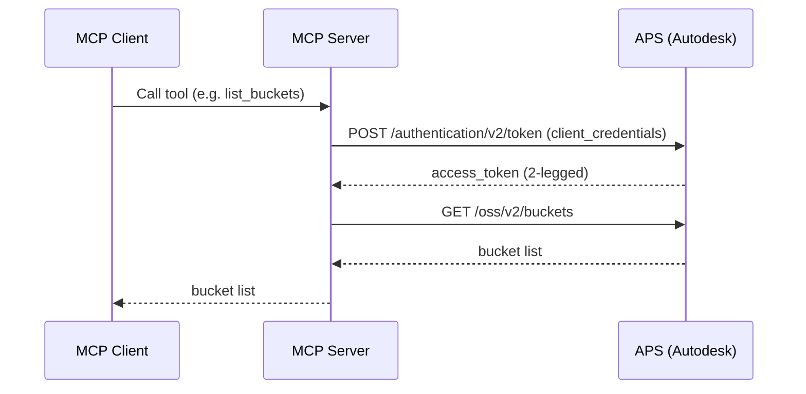
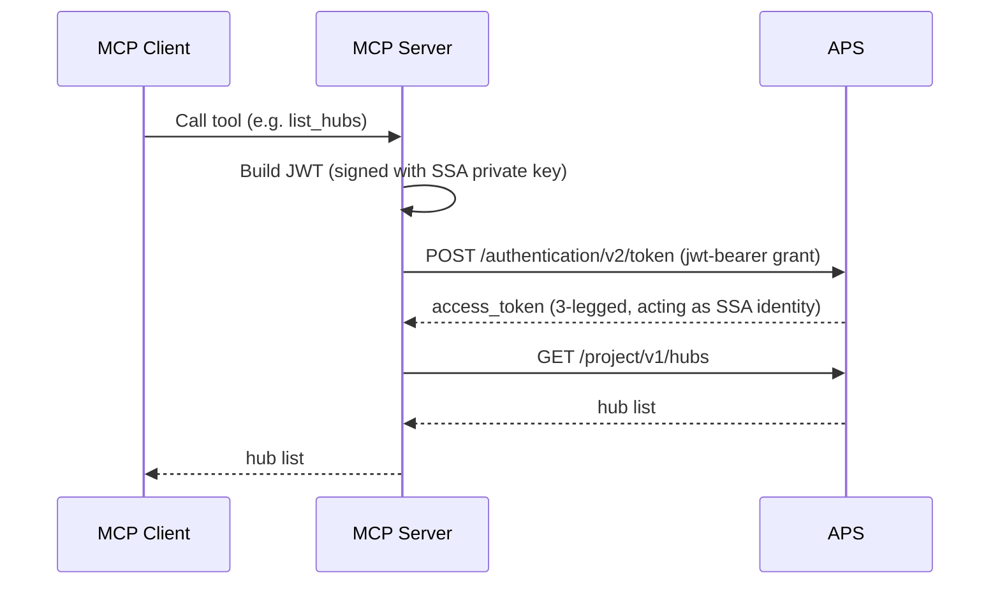
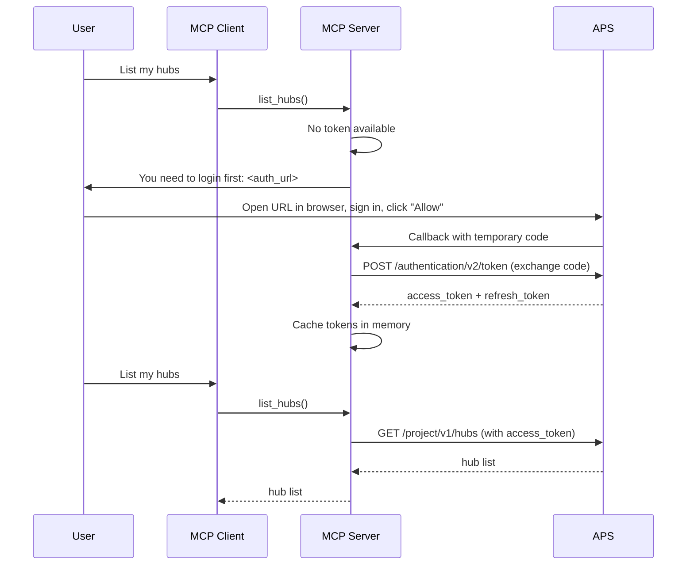

# APS MCP Server Authentication Samples

This repository contains three minimal [Model Context Protocol (MCP)](https://modelcontextprotocol.io) servers built with Python, [uv](https://docs.astral.sh/uv/), and [FastMCP](https://gofastmcp.com). Each server demonstrates a different authentication approach for calling [Autodesk Platform Services (APS)](https://aps.autodesk.com) APIs.

| Server | Auth approach | APIs used | When to use |
| --- | --- | --- | --- |
| `mcp_server_2lo` | Client Credentials (aka 2-legged) OAuth flow | OSS | App-owned resources, no user context needed |
| `mcp_server_ssa` | Secure Service Accounts | Data Management | Automated workflows that require user-context APIs |
| `mcp_server_3lo` | Authorization Code (aka 3-legged) OAuth flow | Data Management | Acting on behalf of real users with explicit consent |

---

## Project layout

```bash
shared/            # APS helpers shared by all servers
mcp_server_2lo/    # Example MCP server with 2-legged authentication
mcp_server_ssa/    # Example MCP server with Secure Service Account authentication
mcp_server_3lo/    # Example MCP server with 3-legged authentication
```

---

## Prerequisites

- **Python 3.13+** and **[uv](https://docs.astral.sh/uv/getting-started/installation/)**
- For `mcp_server_2lo`:
  - An **APS application** of type _Traditional Web App_
- For `mcp_server_ssa`:
  - An **APS application** of type _Server-to-Server_
  - A **Secure Service Account** set up and linked to your application (see [SSA docs](https://aps.autodesk.com/en/docs/ssa/v1/developers_guide/overview/))
- For `mcp_server_3lo`:
  - An **APS application** of type _Traditional Web App_
  - Redirect URI `http://localhost:5002/callback` added to your application's **Callback URL** list

---

## Installation

```bash
git clone <this-repo>
cd aps-mcp-server-python
uv sync
```

---

## Configuration

Copy `.env.example` to `.env` and fill in the values:

```bash
cp .env.example .env
```

| Variable | Required by | Description |
| --- | --- | --- |
| `APS_CLIENT_ID` | All servers | APS application client ID |
| `APS_CLIENT_SECRET` | All servers | APS application client secret |
| `APS_SSA_ID` | `mcp_server_ssa` | Secure Service Account ID |
| `APS_SSA_KEY_ID` | `mcp_server_ssa` | Key pair ID registered with the SSA |
| `APS_SSA_KEY_BASE64` | `mcp_server_ssa` | Base64-encoded RSA private key (PEM) |

To encode your SSA private key:

```bash
# macOS
base64 -i private_key.pem

# Linux
base64 -w 0 private_key.pem
```

---

## Server 1: `mcp_server_2lo`

### How it works

The server calls the APS token endpoint with `grant_type=client_credentials` using HTTP Basic Auth (client ID + secret). The resulting token is tied to the **application identity** and can access resources the application owns.



The token is cached in memory and reused until it is about to expire.

### Tools

| Tool | Description |
| --- | --- |
| `list_buckets` | List all OSS buckets owned by the application |
| `list_objects(bucket_key)` | List objects in a specific bucket |

### Running

```bash
uv run fastmcp run mcp_server_2lo/server.py --transport streamable-http --port 5000
```

### Required scopes

`bucket:read data:read`

---

## Server 2: `mcp_server_ssa`

### How it works

A [Secure Service Account (SSA)](https://aps.autodesk.com/en/docs/ssa/v1/developers_guide/overview/) is an Autodesk identity that can obtain **3-legged tokens** without user interaction. Authentication works by creating a signed JWT assertion and exchanging it for an access token:



The JWT assertion contains:

- `iss`: your application client ID
- `sub`: the SSA ID
- `aud`: the token endpoint URL
- `scope`: the requested scopes
- signed with the RSA private key registered for the SSA key pair

### Tools

| Tool | Description |
| --- | --- |
| `list_hubs` | List all hubs accessible to the service account |
| `list_projects(hub_id)` | List projects within a hub |

### Running

```bash
uv run fastmcp run mcp_server_ssa/server.py --transport streamable-http --port 5001
```

### Required scopes

`data:read`

---

## Server 3: `mcp_server_3lo`

### How it works

The server implements the standard [OAuth 2.0 authorization code flow](https://aps.autodesk.com/en/docs/oauth/v2/tutorials/get-3-legged-token/). The user signs in interactively and explicitly consents to the requested scopes. A lightweight asyncio HTTP server handles the OAuth callback alongside the MCP server.



### Tools

| Tool | Description |
| --- | --- |
| `list_hubs` | List all hubs accessible to the authenticated user |
| `list_projects(hub_id)` | List projects within a hub |

### Running

```bash
uv run fastmcp run mcp_server_3lo/server.py --transport streamable-http --port 5002
```

In this case, the OAuth callback endpoint is `http://localhost:5002/callback`. Make sure this URL is registered in your APS application.

### Required scopes

`data:read`

---

## Testing with MCP Inspector

[MCP Inspector](https://github.com/modelcontextprotocol/inspector) lets you interactively call tools on a running MCP server.

```bash
# In one terminal, start the server you want to test (e.g. 2LO):
uv run fastmcp run mcp_server_2lo/server.py --transport streamable-http --port 5000

# In another terminal, open the inspector:
npx @modelcontextprotocol/inspector http://localhost:5000/mcp
```

For the 3LO server, the typical test sequence in MCP Inspector is:

1. Call `authenticate` — copy the URL from the response
2. Paste the URL into a browser, sign in, and click "Allow"
3. Once the browser shows "Authentication successful", return to MCP Inspector
4. Call `list_hubs`, then `list_projects` with one of the returned hub IDs
